# Projeto DevOps
Repositório do desafio para criar uma pipeline CI/CD que constrói, testa e implanta um aplicativo Python simples em um cluster Kubernetes.

# Pré-requisitos para rodar o projeto
- Docker
- Kind
- Terraform
- Ansible
- Python
- pip3
- Helm
- kubectl
- Make
- openssh-server

# Como rodar o Projeto DevOps:
Clone este repositório

```
git clone https://github.com/janssenlima/projeto-devops.git
```

## Preparação do ambiente
### Gerar a chave SSH
```
ssh-keygen -t rsa
```

```
cat ~/.ssh/id_rsa.pub >> ~/.ssh/authorized_keys
```

Edite o arquivo ```dev``` dentro do diretório ```ansible``` e altere o parâmetro ```ansible_ssh_user``` para o usuário que você estiver logado no sistema.

Execute os comandos abaixos para instalar as collections para serem usadas no playbook do Ansible:

```
ansible-galaxy collection install kubernetes.core
```

```
ansible-galaxy collection install community.kubernetes
```

# Subir o cluster Kubernetes

```
cd cluster
```

Para facilitar o provisionamento do cluster, o comando make pode ser usado para verificar as opções.

```
make
```

Por exemplo, para provisionar o cluster, execute:

```
make init

make plan

make up
```

Você também pode utilizar os comandos do terraform, caso o pacote make não esteja instalado no seu sistema.

```
terraform init

terraform plan

terraform apply
```

Verifique se o cluster está pronto com o comando:

```
kubectl get node
```

Obs.: Por padrão, este laboratório está rodando apenas com o nó no cluster. Se você desejar incluir mais nós (workers node), altera o arquivo ```cluster/main.tf```. Neste arquivo eu deixei um exemplo comentado.

# Fazer o deploy das stacks no cluster com Ansible

Com o cluster em execução, podemos aplicar o deploy das stacks.

Para garantir o funcionamento do ansible para este laboratório, podemos executar os seguintes comandos dentro do diretório ```ansible```:

```
ansible-inventory --list -y
```

Este comando irá retornar com o host ```devops```, que está configurado no arquivo ```dev``` dentro do diretório ```ansible```.

```
ansible all -m ping -u <seu_usuário>
```

Este comando deverá retornar o status ```SUCCESS```

Com o sucesso na execução dos comandos acima, podemos prosseguir com o deploy da stack.

Para isso, na raiz do projeto entre no diretório ansible e execute o seguinte comando:

```
ansible-playbook playbooks/kubernetes.yaml -e host=devops
```

Este comando irá fazer o deploy das seguintes ferramentas:
- Prometheus
- Grafana
- Loki
- Promtail
- ArgoCD


# Acesso as ferramentas

Com a execução do Playbook do Ansible, teremos acesso as seguintes interfaces:
- Grafana
- ArgoCD

O acesso ao Grafana é realizado acessando a URL http://localhost:3000. Antes, precisamos expor a aplicação com o seguintes comandos:

```
export POD_NAME=$(kubectl get pods --namespace monitoring -l "app.kubernetes.io/name=grafana,app.kubernetes.io/instance=devops-grafana" -o jsonpath="{.items[0].metadata.name}")

kubectl --namespace monitoring port-forward $POD_NAME 3000
```

Para esse ambiente de laboratório, o Grafana está habilitado para fazer login automaticamente sem a necessidade de entrar com usuário e senha. Também já configura os datasources para Prometheus e Loki.

Sugestão: Importar os dashboards ID 15141 e 15758 que usaremos para visualização das métricas e dos logs que serão gerados pelo App Python.

O acesso ao ArgoCD é realiza acessando a URL http://localhost:8080. Antes, precisamos expor a aplicação com o seguinte comando:

```
kubectl port-forward service/devops-argocd-server -n argo-cd 8080:443
```

Para acessar o ArgoCD, entre com o usuário ```admin``` e sua senha, que deve ser consultada executando o seguinte comando:

```
kubectl -n argo-cd get secret argocd-initial-admin-secret -o jsonpath="{.data.password}" | base64 -d
```

# Aplicativo e Pipeline CI/CD

O aplicativo ```app-python``` tem o propósito de gerar logs que serão capturados pela ferramenta Promtail e encaminhados para a ferramenta Loki. Esses logs poderão ser visualizados no Grafana.

Esta aplicação está disponível no repositório https://github.com/janssenlima/app-python. Você pode clonar esse repositório para configurar o pipeline com a sua conta do Docker Hub.

O deploy dessa aplicação será realizado pelo seguinte fluxo:
- Alteração no repositório será disparada uma ação usando o GitHub Actions que irá gerar a imagem Docker da aplicação e fazer o push para o Docker Hub.
- O deploy da aplicação será disparado pelo ArgoCD quando houver mudança no diretório ```infra-app-python```, que é o diretório que contém o helm chart para o deploy da aplicação no cluster.

## Configurações para o GitHub Actions
### Criar secrets para Actions se comunicar com o Docker Hub
No seu repositório, acesse Settings >> Secrets and variables >> Actions. Cria as seguintes secrets em ```Repository secrets```.
- DOCKER_USERNAME
- DOCKER_PASSWORD

### Configurar workflow no Actions
Acesse o Actions e crie um novo workflow conforme o seguinte exemplo:

```
name: Docker Image CI

on:
  push:
    branches: [ "main" ]
  pull_request:
    branches: [ "main" ]

jobs:

  push-docker-image:

    runs-on: ubuntu-latest

    steps:
    - uses: actions/checkout@v3

    - name: Docker Login
      uses: docker/login-action@v2.2.0
      with:
        username: ${{ secrets.DOCKER_USERNAME }}
        password: ${{ secrets.DOCKER_PASSWORD }}
    - name: Armazenar data do build
      id: date
      run: echo "::set-output name=date::$(date +%s)"    
    - name: Build Docker images
      run: docker build . --file Dockerfile --tag janssenlima/projeto-devops:${{ steps.date.outputs.date }} --tag janssenlima/projeto-devops:latest
    - name: Push Docker images
      run: |
        docker push janssenlima/projeto-devops:${{ steps.date.outputs.date }}
        docker push janssenlima/projeto-devops:latest
```


Neste laboratório, qualquer arquivo alterado no repositório irá disparar o workflow, fazer o build da imagem e o push para o Docker Hub. Observe que a imagem terá o tag com o timestamp do momento que a imagem é gerada.

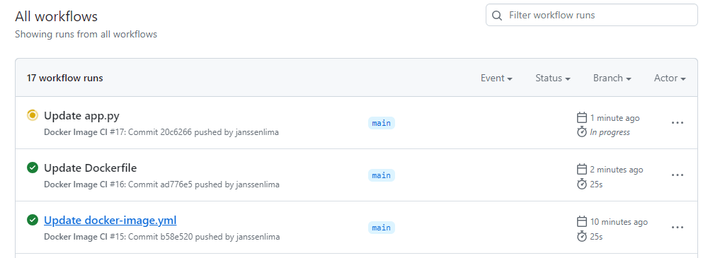

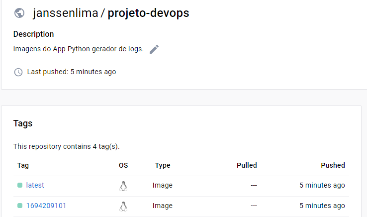


## Configurações na interface do ArgoCD
### Conectar repositório
Precisamos configurar a conexão do ArgoCD com o repositório da aplicação. Na interface do ArgoCD, vá para Settings >> Repositories. Clique em ```+ CONNECT REPO``` e insira as informações conforme a imagem:

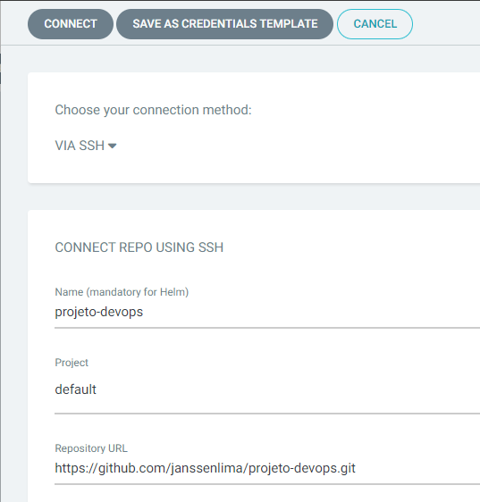


Clique em ```CONNECT```

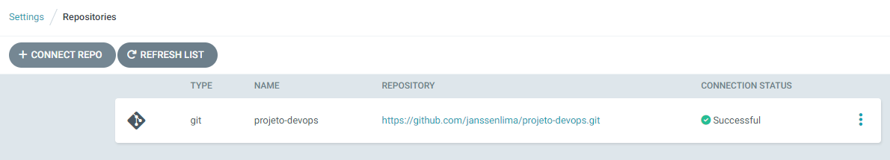


### Criar o App no ArgoCD
Com o repositório conectado, vamos criar um novo App no ArgoCD que fazrá a sincronização com o repositório e fazer ou atualizar o deploy no cluster Kubernetes.

Clique em Applications no menu e em seguida em ```NEW APP```

Preencha as informações solicitadas marcadas conforme as imagens a seguir.

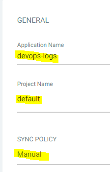

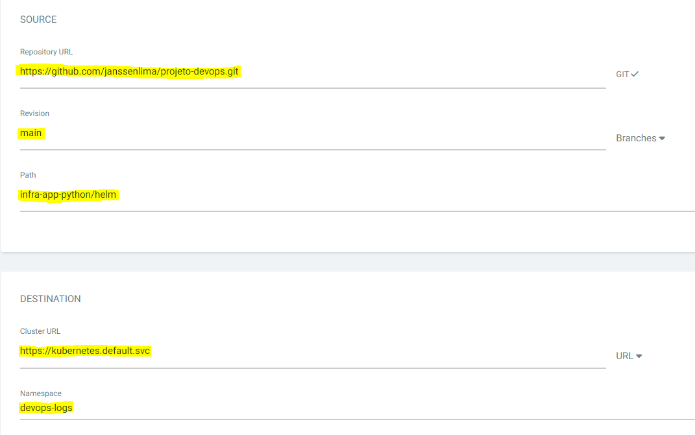

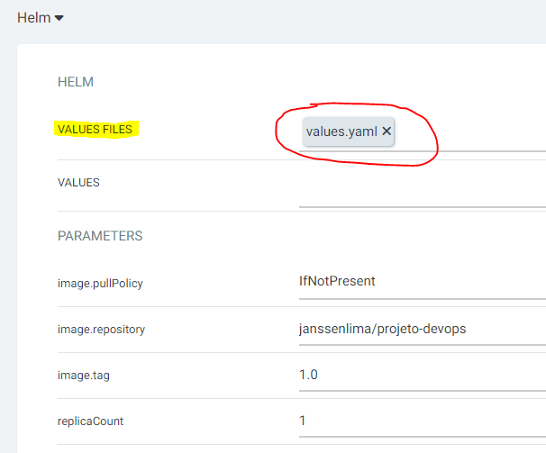

Clique em ```CREATE```

O Status da aplicação será exibido assim:

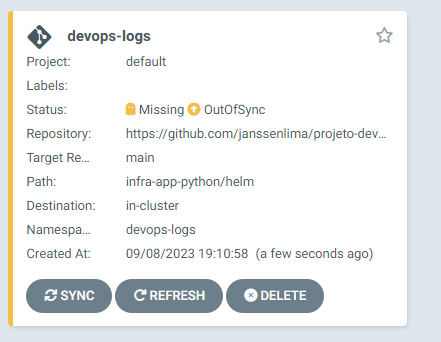

Isso acontece porque deixamos o scincronismo manualmente. Clique em ```SYNC``` e em seguida clique em ```SYNCHRONIZE```

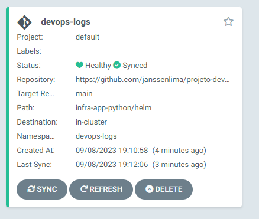


Com tudo validado, você pode habilitar a sincronização automática do repositório e fazer alguma alteração no repo com o código-fonte da aplicação Python para gerar uma nova imagem. Anote a tag com o timestamp gerado e muda essa tag no reposiório projeto-devops no chart da aplicação. Automaticamente o ArgoCD vai sincronizar o repositório e fazer o rollout com a nova versão da imagem da aplicação.

# Imagens do Grafana com os logs e métricas da aplicação

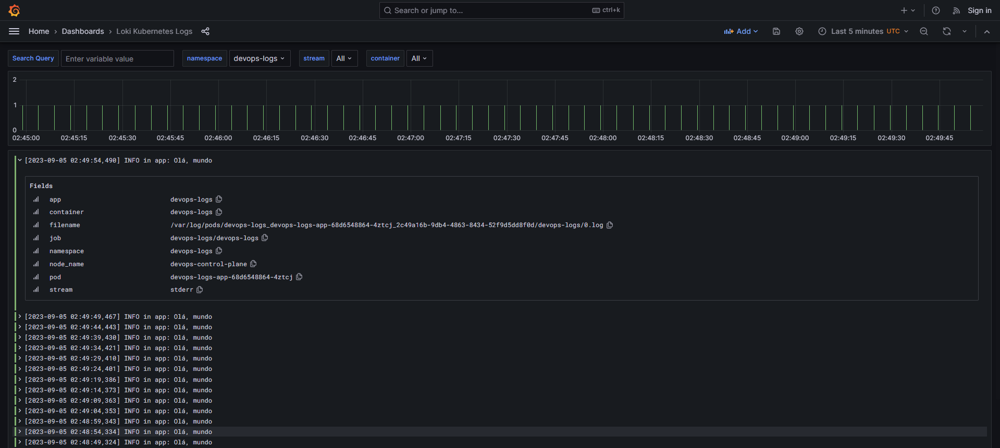


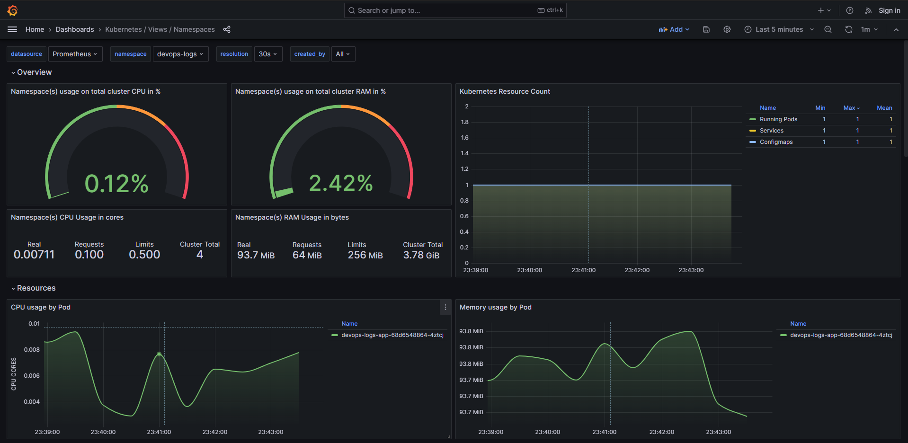